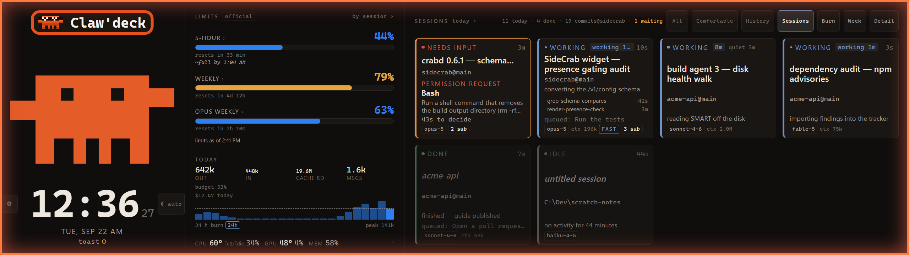
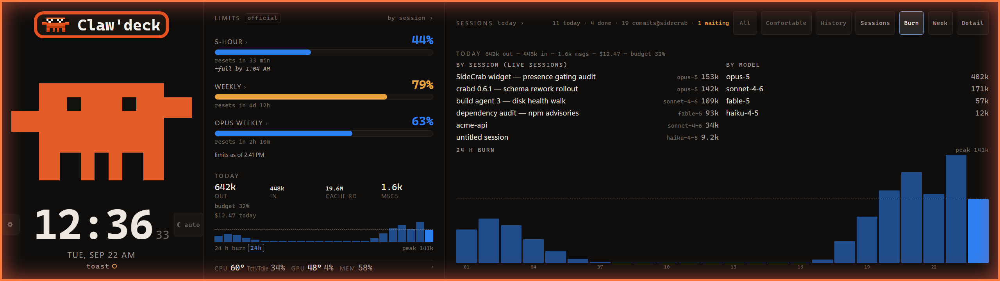
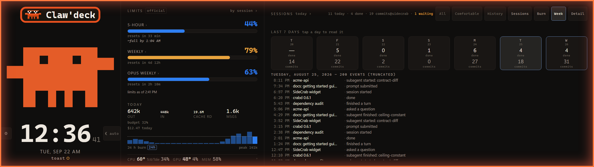
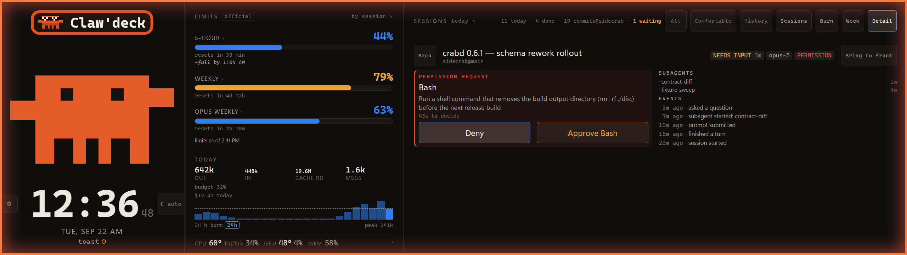
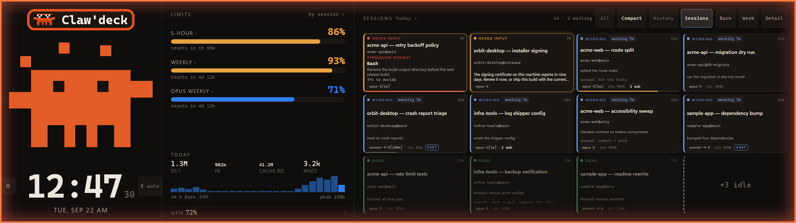
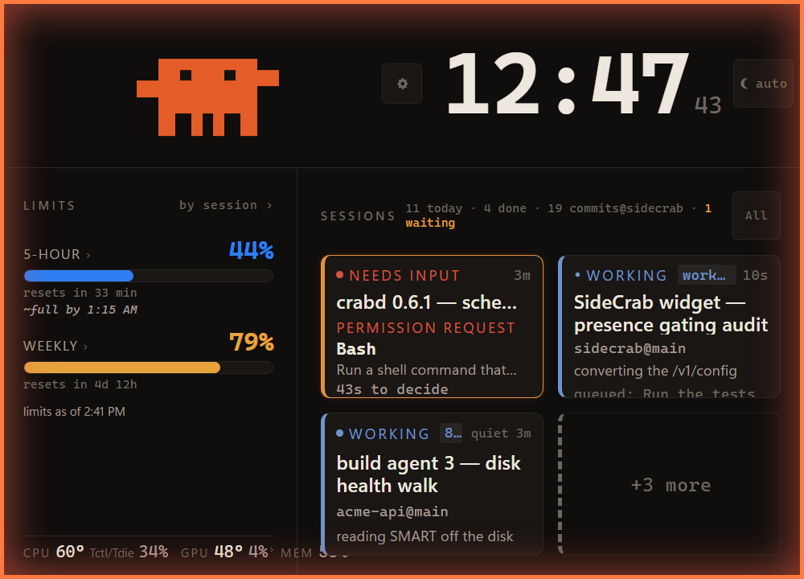
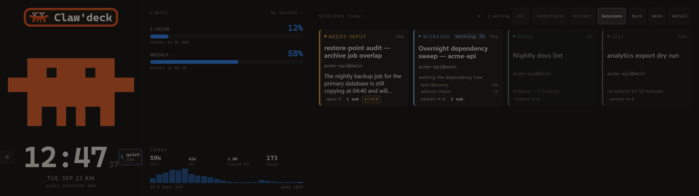
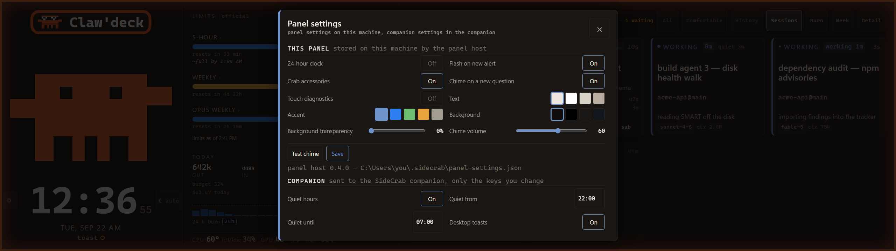
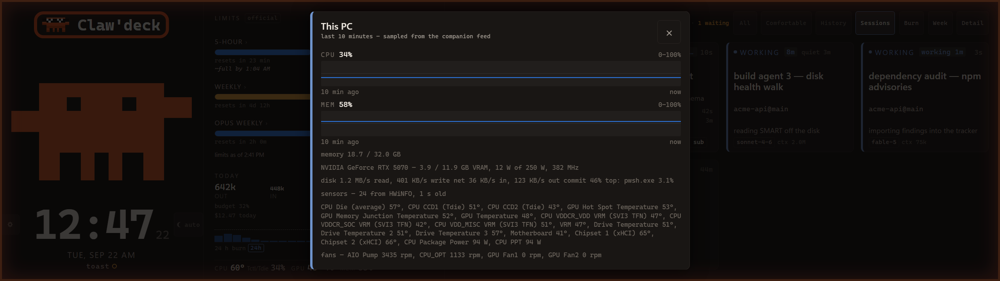

# SideCrab 🦀

[](https://github.com/Dixie-sketch/Clawdeck/actions/workflows/ci.yml)
[](LICENSE)
[](#what-you-need)

**An ambient Claude Code status panel for the Corsair Xeneon Edge.**

SideCrab turns the Xeneon Edge on your desk into a live view of every Claude Code session on your
PC: session cards, rate-limit gauges with a reset countdown, today's token burn, a clock, and a
pixel crab whose mood *is* the status. When a session stops to ask you something, you find out
from across the room instead of by cycling through terminal windows. Then you can answer it from
the panel.



## Install

**From a release package.** This is the ordinary way in, and it needs no Git and no .NET SDK.
Download `SideCrab-<version>-win-x64.zip` from [the latest
release](https://github.com/Dixie-sketch/Clawdeck/releases/latest), extract it anywhere you can
write to, and open **PowerShell 7** in the extracted folder on the PC where you run Claude Code:

```powershell
pwsh -File .\setup\Test-SideCrabPrerequisites.ps1   # what this PC still needs, with the links
pwsh -File .\setup\Install-SideCrab.ps1
```

The package carries the panel host already compiled, so the installer runs no build. It checks
every file against the manifest that shipped inside the zip, prints the version, the commit and
the build time, and refuses to install a package whose contents do not match.

**From a checkout**, to work on SideCrab or run a commit that has no release yet. This path needs
Git and the .NET SDK, because the installer builds the panel host itself:

```powershell
git clone https://github.com/Dixie-sketch/Clawdeck.git C:\Dev\sidecrab
cd C:\Dev\sidecrab
pwsh -File .\setup\Install-SideCrab.ps1
```

Either way, that installs all three pieces and starts them. Start a Claude Code session and a card
for it appears on the panel within a few seconds. Add `-WhatIf` to see every step without
performing any of it.

You also need **Python 3.13**, the **.NET Desktop Runtime**, the **WebView2 runtime** and a
**Xeneon Edge**; [what you need](#what-you-need) is the full list, and [Getting
started](docs/GETTING-STARTED.md) is the same install as a 20-minute walkthrough, with what you
should see at each step.

Everything runs on one PC and talks only over `127.0.0.1`. Nothing is sent anywhere. Panel
approvals ship **off**; read [Before you turn on panel
approvals](#before-you-turn-on-panel-approvals) first.

> Coming from the old widget? SideCrab is now a standalone application and needs no other desktop
> software. [Install notes: moving to the standalone panel](docs/UPGRADING-TO-STANDALONE.md) has
> the upgrade path, and the widget and why it went are recorded in
> the maintainers' history.

---

## What you need

| | Required | Notes |
|---|---|---|
| **Operating system** | **Windows 10 or 11** | Windows only. The companion is a Windows service and the notifier uses Windows toasts. There is no macOS or Linux build. |
| **A Corsair Xeneon Edge** | 2560 × 720 | The panel is laid out full-screen for the Edge and pins itself to it by device id. It runs on another display, at a reduced layout. |
| **Claude Code** | Installed and used on the **same PC** | The companion reads Claude Code's local session data. It cannot see sessions on other machines. |
| **PowerShell 7** (`pwsh`) | For the companion installer | Not Windows PowerShell 5.1. [Get it](https://aka.ms/powershell). |
| **Python 3.13** | For the companion | A real install on `PATH`. The Microsoft Store "python" alias stub is rejected, because it cannot host a background service. [Get it](https://www.python.org/downloads/windows/). |
| **.NET Desktop Runtime** | For the panel host | The runtime only, not the SDK, when you install from a release package. [Get it](https://dotnet.microsoft.com/download/dotnet/10.0). Pass `-SkipPanel` to install the companion and notifier without it. |
| **WebView2 Evergreen runtime** | For the panel host | Ships with Windows 11 and most Windows 10 installs, so you usually have it already. [Get it](https://developer.microsoft.com/microsoft-edge/webview2/). |
| **.NET SDK** | Only to build from a checkout | The installer compiles the panel host when the executable is not there. A release package carries it already built, so nobody installing one needs an SDK. |
| **HWiNFO** | Optional | Temperatures and fan speeds. Everything else works without it. [Get it](https://www.hwinfo.com/download/). |

Run `pwsh -File .\setup\Test-SideCrabPrerequisites.ps1` to see which of these this PC has. It
writes nothing, prints one row per prerequisite with the fix and the download link, and exits
non-zero when something required is missing. The installer runs the same check and declines to
register the panel task when the .NET Desktop Runtime or WebView2 is missing, rather than
registering a task that would fail at every logon.

---

## What gets installed

Three pieces, all of them yours, all on one PC:

**The companion** (`crabd`, the `SideCrab-crabd` task). A small local service on the PC where you
use Claude Code. It reads Claude Code's own session data, serves `/v1/state` on
`http://127.0.0.1:2722`, and serves the panel page itself at `/panel/`.

**The panel host** (`SideCrab.Panel`, the `SideCrab-panel` task). A .NET 10 + WebView2 window that
shows that page full-screen on the Xeneon Edge: borderless, always on top, never steals focus, no
taskbar entry, pinned to the Edge by device id and re-pinned after sleep and display changes. It
owns its own settings and reads the approval pairing code itself.

**The notifier** (`SideCrab-toast`). Windows toasts when a session needs you, with Acknowledge and
Snooze buttons that reach back into the panel.

You get live session cards, limit gauges with a depletion forecast, burn history and an optional
daily token budget, a daily recap with a drillable week strip, and alerts when a session is
waiting on you. CPU and GPU readings come through the companion from HWiNFO and `nvidia-smi`; see
[Sensors and temperatures](#sensors-and-temperatures). Pass `-SkipPanel` or `-SkipToast` to install less.

---

## How it works

```
Claude Code hooks ──POST──▶  crabd (127.0.0.1:2722)  ──write─▶ /v1/action · /v1/config
~/.claude usage + JSONL ──▶  one /v1/state JSON feed  ◀──poll── notifier (Windows toasts)
                             + blocking hook answers
                             + GET /panel/ (the page)  ◀── SideCrab.Panel (Xeneon Edge, WebView2)
```

1. **Claude Code tells crabd what is happening.** The installer adds a few *hooks* to your
   `~/.claude/settings.json`. Each one is a tiny localhost POST that fires when a session starts,
   when you submit a prompt, when a session stops, and when it needs your attention. They time out
   in two seconds and never block Claude Code if crabd is not running.
2. **crabd keeps the picture.** It turns those events into per-session state (working, waiting,
   finished, needs input), reads your rate limits from the same local credentials Claude Code
   uses, and reads the session transcripts read-only for token burn and elapsed time. It serves all
   of that as one JSON document on `http://127.0.0.1:2722/v1/state`.
3. **The panel draws it.** The panel host loads the page from crabd at `/panel/` and repaints as
   each new picture arrives. The crab's posture is the summary: calm when all is well, alert when
   something waits on you, worried when the feed is stale or gone.
4. **Taps go back the same way.** Acknowledge, dismiss, pin, "Continue", and (if you turn it on)
   approve or deny go to crabd on localhost. Nothing free-text is ever sent to a session.

**What the companion reads:** `~/.claude` (session transcripts, hook payloads, the local usage
credential). **What it never does:** write to `~/.claude`, log or transmit your OAuth token, listen
on a network interface, or send anything off the machine. The only outbound call is the usage-limit
check to Anthropic's API with your own token, the same call Claude Code makes.

**The panel is honest about not knowing.** No companion, a stopped companion, or a feed older than
30 seconds all produce a worried crab and a "data as of HH:MM" banner. Unknown values render as an
em-dash, never as zero. A green-looking panel always means the data is fresh.

---

**No `curl.exe` any more.** SideCrab's hooks used to shell out to `curl.exe` for every event: a process
per prompt, per notification, per subagent, and a dependency on Windows' own curl being on your PATH.
Nine of the ten events now post straight to the companion over HTTP. `SessionStart` is the exception,
because Claude Code does not run HTTP hooks on that one event, so it keeps its curl entry. If the
companion is not running, nothing happens to your session: an HTTP hook whose endpoint is refused or
slow produces no decision, Claude stops normally, and permission prompts appear in the terminal as usual.

## Setting it up

The three commands are at the top of this page. This section is what they do and what to do next.

### What the installer does

It:

- verifies the package it is running from, when there is one. Every file is hashed against
  `package-manifest.json`, the version, commit and build time are printed, and a package whose
  contents do not match refuses to install and names the first file that differs,
- checks this PC's prerequisites, and skips the panel task rather than registering one that
  cannot start when the .NET Desktop Runtime or the WebView2 runtime is missing,
- builds the panel host (`panel-host\dist\SideCrab.Panel.exe`) **only when it is not there yet**,
  which needs the .NET SDK. A release package carries the host already built, so this step never
  runs from one. In a checkout without an SDK the build fails, the installer says so and carries
  on with the companion and the notifier; pass `-SkipPanel` to stop being offered it,
- registers a logon Scheduled Task per component and starts each one,
- backs up `~/.claude/settings.json`, then merges in the SideCrab hook entries. Re-running never
  duplicates them and other hooks are left alone,
- registers the toast identity and the `sidecrab-ack:` handler for the notifier, under `HKCU`,
  no elevation needed,
- leaves panel approvals **off**. Read [Approving a permission request from the panel](#approving-a-permission-request-from-the-panel) before turning them on.

Nothing is built and nothing is registered under `-WhatIf`.

Then check it:

```powershell
pwsh -File .\setup\Install-SideCrab.ps1 -Status   # read-only status of every piece
pwsh -File .\setup\Test-SideCrab.ps1              # end-to-end smoke test, PASS/FAIL table
```

Start a Claude Code session. Within a few seconds a card for it appears, and the panel is
full-screen on the Xeneon Edge.

If another application is still drawing its own dashboard on that screen, turn that dashboard off
for the Edge in whatever put it there.

### The panel host's settings (optional)

Settings live in `~/.sidecrab/panel-settings.json`. Every key has a default, so the file is
optional:

```jsonc
{
  "crabdPort": 2722,
  "display": { "deviceId": "CRXED00", "width": 2560, "height": 720 },   // the Edge's PnP id, or its exact size
  "props":   { "clock24": true, "accentColor": "#6F94CC", "alertFlash": true, "crabStyle": true }
}
```

`props` are the panel's own display settings: `clock24`, `alertFlash`, `crabStyle`, `textColor`,
`accentColor`, `backgroundColor`, `transparency`, `touchDiag`. Quiet hours, toast, digest and
budget are **not** props: `~/.sidecrab/config.json` is their one home. See
[Configuration](#configuration).

The pairing code for approvals is read from `~/.sidecrab/panel-token` by the host itself; there is
nothing to paste anywhere. The host logs what it did to `~/.sidecrab/logs/panel.log`: which display
it picked, the viewport it measured, every re-pin, and every period it spent hidden because the
target display was absent.

### Keeping the limit gauges alive (recommended)

The gauges read the same OAuth token Claude Code uses. That token lives about six hours and is
only rewritten when a terminal `claude` session makes an API call, so on a machine where you
mostly use the desktop app the gauges go dark by the next morning. Fix it once with a long-lived
token:

```powershell
claude setup-token                                            # opens a browser sign-in, prints a token
pwsh -File .\setup\Install-SideCrab.ps1 -LimitsToken           # paste it; stored DPAPI-encrypted for your account
```

crabd uses the stored token only when the CLI's own token has expired. It is decrypted in memory
on each poll, never logged and never served. `Install-SideCrab.ps1 -Status` shows whether one is
stored; `Test-SideCrab.ps1` shows which token is answering.

### Updating and uninstalling

**To take a new release, download the new package, extract it and run the installer again.** That
is the supported upgrade: tasks are re-registered from scratch, your hooks are replaced rather
than duplicated, `settings.json` is backed up first, and your settings, history and credentials in
`~/.sidecrab` are untouched. Extract over the old folder or beside it; either works.

```powershell
pwsh -File .\setup\Install-SideCrab.ps1                   # the upgrade, from a new package
pwsh -File C:\Dev\sidecrab\setup\Update-SideCrab.ps1      # a checkout: pull, stage, validate, swap, verify
pwsh -File C:\Dev\sidecrab\setup\Uninstall-SideCrab.ps1   # removes tasks, hooks and both registry keys
```

`Update-SideCrab.ps1` is the checkout path. It fast-forwards the checkout, restarts the companion
and the notifier, verifies that the companion answers, and then **stages the panel host**: it
publishes the new host into `panel-host\dist.staging` while the working one stays where it is,
proves the new binary runs by calling its own `--check`, keeps the host it is replacing as
`panel-host\dist.last-good`, swaps by rename, and waits for the panel task to come back Running.
Anything that fails before the swap leaves the live host untouched; anything that fails after it
puts `dist.last-good` back, restarts it, and says what was restored and what is running. It
**exits non-zero** whenever any of that does not stand.

Put the previous host back yourself at any time:

```powershell
pwsh -File .\setup\Restore-SideCrab.ps1 -Host   # restores panel-host\dist.last-good and restarts the task
```

One generation is kept. The host that is replaced moves to `panel-host\dist.failed` rather than
being deleted, so there is something to look at afterwards. `Update-SideCrab.ps1 -Package <zip>`
swaps the panel host out of a release package with the same staging and rollback, which is useful
on a PC with no SDK; it updates the host only, so a full upgrade is still an installer re-run.

An uninstall removes wiring and keeps your data. It prints what it left behind and the command
that removes it. `-Purge` additionally deletes `~/.sidecrab`: your settings, your history, **and
the two credential files** (the approval pairing code and the stored limits token). Backups of
`settings.json` are never removed at any switch; prune them with
`Restore-SideCrab.ps1 -PruneOlderThan`.

---

## Using it

### At a glance

- **The crab** is the summary. Calm = nothing needs you. Alert with a glow = a session is
  waiting. Worried and grey = the data is stale or the companion is gone. It sweats when a limit
  is nearly full, and it has a few tricks it does on its own.
- **Session cards** show state, model, elapsed time, the repo it is working in, a hairline for how
  full that session's context window is, and a "queued: …" line when you have sent it a next step.
- **Limit gauges** show each rate-limit window, how full it is, when it resets, and a forecast of
  when the recent burn rate would fill it.
- **TODAY** shows token burn with a sparkline, the daily budget if you set one, and cost when
  Claude Code's telemetry is flowing to the companion.
- **The week strip** is the daily recap: sessions, commits in your configured repos, tokens.
- **The hardware row** shows the CPU temperature with the sensor's own name beside it, the
  graphics card's temperature and utilisation, and memory. They come from the companion, which
  reads HWiNFO's shared memory and `nvidia-smi` (see [Sensors and temperatures](#sensors-and-temperatures)). Tap
  the row for the last ten minutes and for everything the row has no width for: the VRM, each
  drive, motherboard and chipset, CPU package power, every fan and pump, the card's VRAM and power
  draw, and what the whole machine is doing with its disks, network and memory. With no HWiNFO
  the row shows what it always showed; with no NVIDIA card the GPU cell is simply not there.
  On a narrower panel the row drops what it has no room for, the sensor's own name first, then the last
  reading, then the one before it; the sheet behind it lists every reading whatever the row had space for.

### Touch

| Gesture | Does |
|---|---|
| **Tap** a card | Opens its detail sheet: the question it is asking, subagents, the last event |
| **Swipe** a card | Acknowledge or dismiss it |
| **Long-press** a card | Pin it to the front (again to unpin) |
| **Two-finger tap** anywhere | Acknowledge every waiting session at once |
| **Tap the crab** | Same as two-finger tap |
| **Pull down** from the top edge | Fetches fresh state now, or restarts a live connection that has gone quiet |
| **Tap a gauge** | That window's detail: how full, when it resets, when it would fill |
| **Tap a day** in the week strip | Drill into that day; page with prev/next |
| **Tap the moon** beside the clock | Quiet for an hour · stay awake through tonight's window · back to schedule |
| **Filter and density chips** (top right) | Show only waiting / working / finished; comfortable or compact cards |
| **View chips** at the right of the Sessions header, or **swipe** across that header | Sessions, Burn, Week or Detail; the choice is remembered |
| **Tap History** beside the view chips | Today's events as a timeline, newest first, with the week strip to drill another day. It is there only while the feed is live |
| **Bring to front** in a card's sheet, or the chip beside Back on the Detail page (standalone host) | Puts that session's window in front on your main display; the panel keeps its hands off the keyboard |
| Read the last line of a working card | The tool it is running and what for, with the call count this turn |
| **Cancel** beside a queued prompt | Removes it, or says it was already sent |
| **Tap the gear** beside the clock (standalone host) | The panel's settings sheet: clock format, alert flash, crab accessories, colours, transparency, the chime and Test chime |
| **Tap the hardware row** | Ten minutes of CPU, memory, GPU utilisation and disk throughput, plus every other sensor the row has no width for |

### Four views, one display

The Sessions half of the panel shows one of four things, and the chips at the right of its header
choose which. A swipe left or right across that header row steps through them, and the panel
remembers the one you picked.

- **Sessions** is the card grid, one card per live Claude Code session, and what the panel shows
  out of the box. The **All** and **Comfortable** chips beside the switcher narrow and tighten this
  view and no other.
- **Burn** is today's spend at full width: what each live session and each model has produced, the
  last 24 hours as a chart with the hours marked, the day's totals, the dollar figure when Claude
  Code's telemetry is flowing, and how much of your daily budget is used. Where the companion has
  no figure, the panel leaves that half out and says so rather than showing a zero.
- **Week** is the last seven days, one column per day: sessions finished and commits made. Tap a
  day and its history opens underneath the strip, newest first. A day the companion cannot read
  leaves the strip where it is and tells you why; tapping it again tries again.
- **Detail** is one session as a page, with what a card has no room for: the whole question, the
  full permission request with the same Approve and Deny buttons the card's sheet gives you, the
  context window in tokens as well as on the bar, every subagent, the whole event list, and the
  continue buttons. Open it from a card's sheet with **Full view**, or tap the **Detail** chip,
  which opens whichever session most wants your attention. **Back** returns you to the cards.







**A question never hides behind a view.** If a session starts waiting while you are looking at
Burn, Week or Detail, the Sessions chip grows a pulsing count. The panel never switches views on
its own, because moving the glass while your finger is on the way to it is worse than the thing
it would be warning about.

The density chip names the density it is in, and tapping it swaps them: **Comfortable** out of
the box, **Compact** for a third row of smaller cards in the same space. It narrows the card grid
and nothing else. Sessions the grid has no room for collect in a tile at the end.



The **History** chip sits beside the switcher and is not a view: it opens today's events as a
timeline over the panel, with the week strip underneath to drill another day. It appears only
while the feed is live, because a companion that has stopped answering `/v1/state` will not
answer for history either. When a read fails it says **No history** and the next tap tries again.

On a slot too narrow for the switcher the panel shows the cards and hides the chips. Your choice
comes back on a slot wide enough to show it.



### Quiet hours

Quiet hours dim the whole panel, and nothing toasts or chimes. The moon chip beside the clock says
how long the quiet has left to run, and names an override you tapped rather than the schedule. Tap
it for an hour of quiet, again to stay awake through tonight's window, again to go back to the
schedule.



### The crab

Claw'd moves now. He breathes while idle, blinks every eight to ten seconds, sweeps an arm when a
session wants you, sweats when a usage window goes red, and juggles, hops, snaps a claw or dances
when the fleet gives him a reason. He still wears his sunglasses when everything is running and
nothing is hot, his party hat when a session lands, and his nightcap during quiet hours. Tapping
him still acknowledges every waiting session at once. During quiet hours, and on a machine set to
reduce motion, he holds still.

### Bring a session to the front (standalone host)

Tap a card, and the sheet offers **Bring to front** under Pin session; the Detail view carries the
same control as a chip beside Back. Tapping it puts that session's window in front of you on your
main display, so you can answer at the keyboard without hunting for it. The panel itself never
takes the keyboard: it has no taskbar entry, it is not in Alt-Tab, and bringing another window
forward does not change that. It only ever looks at your main display, never at the Edge.

| It says | What happened |
|---|---|
| brought to front | A window matched that session and it is in front of you now. |
| brought the Claude app to the front | The Claude desktop app is in front. It keeps every session in one window, so pick the session in its sidebar. |
| more than one window could be this session | Two windows looked equally likely. Nothing was moved, on purpose. |
| no window found for this session | Nothing on your main display looks like that session. |

**It does not answer for you.** Nothing in SideCrab types into a session, pastes into one, or
clicks anything inside one. A session's multiple-choice question is answered in that session, by
you; getting the right window in front of you is the whole of what this control does. Approve and
Deny are not an exception to that rule: a tool permission request is a question Claude Code asks
outside the session's own prompt, over a channel built for an answer, which is why the panel can
answer it and nothing else.

### Live updates, settings on the glass, and the chime

**The panel updates itself.** The companion pushes each new picture over `GET /v1/events` as it
has one, so a question that needs you appears on the glass when it is asked rather than up to
three seconds later. If that connection drops (you restart or update the companion) the panel
goes back to asking every three seconds and keeps trying the faster route in the background;
nothing to restart, nothing to configure. The worried crab and the "data as of" banner still mean
exactly what they meant.

**Settings on the glass.** Tap the gear beside the clock for a sheet with the things you would
otherwise edit by hand: the 24-hour clock, the flash on a new alert, the crab's accessories,
touch diagnostics, the chime and how loud it is, text, accent and background colour from a small
palette, and background transparency. Tap **Save** and the panel applies it immediately, no
restart and no reload. It is written to `~/.sidecrab/panel-settings.json`, the same file you can
still edit by hand; the sheet leaves everything else in it alone. Two things are deliberately not
on the sheet: the companion's port and the monitor, because a mistake in either leaves you with a
window you cannot see, and the approval pairing code, which is never handed to the page at all.

**The chime.** When a session stops and asks you something, the panel plays a short two-note
chime. Once, for that question: not again while it waits, not for a question that was already
waiting when the panel started, and not more than once in five seconds however many sessions
land together. It is silent during quiet hours. It is on by default; turn it off or change the
volume in the settings sheet, where **Test chime** plays it at whatever the slider says. It needs
the standalone panel host; a browser tab at the panel's address plays it only after you have
tapped something on the page, which is the browser's own rule about sound.

### Panel settings and companion settings

Tap the gear to open **Panel settings**. It has two halves and they save to different places, which
the sheet says on each one. **This panel** holds the clock format, the alert flash, the crab
accessories, the chime and its volume, touch diagnostics and the colours, stored on this machine by
the panel host. **Companion** holds quiet hours, desktop toasts and their two thresholds, the daily
digest and the daily token budget, sent to the companion. Only what you change is sent, so opening
the sheet and saving cannot overwrite a value you edited in the config file by hand; if the companion
declines or corrects part of a save, its own words appear beside the Save button. The continue
prompts this session is offered are listed below the companion half, read-only: they are edited in
the config file.



### Cancelling a queued continue

A queued prompt has a **Cancel** beside it, on the session sheet and on the Detail page. It answers
with what happened: **cancelled**, **already sent at 14:32** (the session picked it up first), or
**nothing queued**.

### Sources and approval readiness

Open the hardware row for the last ten minutes of CPU and memory and, when the companion provides
it, a **Sources** list: which feed each number comes from (hooks, transcripts, the status line, the
limits token, telemetry, HWiNFO, the GPU), whether it is fresh, and how old it is. A reading the
companion cannot take is absent, never a zero. When approvals are turned on in the companion, the
approval sheet and the settings sheet show whether this panel is ready to decide and, if not, why:
approvals off, no pairing code minted, or this panel not paired. The pairing code is never shown.



### What a session is doing

The companion reads a few more things out of the transcript Claude Code already writes, so a card
can show what a session is up to rather than only that it is busy. Each appears only when there is
something to show; a session the companion has just picked up shows none of them.

- **The tool it is running and what for.** While a session works, its card's last line reads
  "Bash · run the tests" (the tool and the description Claude Code gave it), with the number of
  tool calls this turn. The file names and tool descriptions are the only things taken from a tool
  call; the command itself never leaves the companion, because a command line can carry a
  password and the panel sits on a desk.
- **The permission mode**, as a chip beside the model: PLAN, AUTO-EDIT or BYPASS. Normal shows
  nothing.
- **Its task list**, when the session keeps one: a thin progress line on the card with "3/7", and
  the item in progress on the Detail page.
- **On the Detail page:** how many files it has edited and the last few by name, how many prompts
  you have typed ahead of it (Claude Code's own queue, which is not the panel's continue queue),
  and whether it is compacting its context right now and how often it has.

**A turn that died.** When Claude Code hits a rate limit, an authentication failure or an overloaded
server, the turn ends on an error rather than finishing. SideCrab shows that card as **failed** and names
the error. Before, there was nothing to see: the card stayed on "working" until it went quiet fifteen
minutes later, which looks exactly like Claude thinking hard. A failed card clears itself the moment you
send the next prompt, and it never counts toward the day's finished total.

**Exact subagent counts.** SideCrab pairs each subagent's start with its stop by id, so the running count
on a card is a count and not an estimate, and the Detail page lists them by type (`general-purpose`,
`Explore`, a custom agent of your own) with how long each has been going, up to eight. A session on an
older CLI that sends no ids keeps the previous estimate.

**Quieter notifications.** Claude Code sends a notification for several things that are not questions:
an agent finishing, a sign-in succeeding, a quota resuming on its own. Those land in the card's event
list without lighting it up as waiting on you. Anything that is a question still does.

### The tray icon and the display picker

The panel host puts an icon in the notification area of the display you work on. Its first line says
what the panel is doing: the display it is on, or that it is hidden and why. The menu offers
**Status and diagnostics** (version, process id, uptime, display, whether the page is loaded, the
last failure, the restart policy, the log path), **Open the log folder**, **Reload the panel**,
**Re-pin now**, **Pause** (hide until you resume), **Show the panel on...** and **Quit until next
logon**. Nothing in the menu takes the keyboard from what you are typing.

**Show the panel on...** lists every monitor with its full device id, size, position, scaling and
which one is primary. Picking one applies it at once and asks, on your primary display, whether to
keep it; with no answer in ten seconds it goes back on its own, so a mistaken pick can never leave you
without a way back. The pick writes `display.deviceId` in `panel-settings.json` and nothing else. The
panel is never parked on your primary display by accident: when nothing matches the configured id,
the size fallback skips the primary and refuses to choose between two matching monitors. A host that
starts with its monitor unplugged stays hidden, keeps looking every five seconds, and comes back when
the monitor does.

#### Ask the host what it would do

```powershell
$report = .\panel-host\dist\SideCrab.Panel.exe --check | Out-String
$report
```

It prints one fact per line and shows no window: every display with its device id and size, which
one the host would pick and why, the WebView2 runtime version, the settings file and every warning
in it, the log path, and whether another host is running. Exit 0 means the panel would show; 2
means something named in the output stops it. The pipe matters: the host is a windowed program and
PowerShell only waits for it when the output goes somewhere. It is safe to run beside the installed
host.

Two things about picking a monitor: if two monitors carry the device id you configured (two Edges
both contain `CRXED00`), the panel stays hidden and the tray says so; pick one from **Show the panel
on...** and the host writes an id that matches that monitor and no other. If you pick a display
larger than your primary monitor, Windows caps the window at the primary's size; the host logs what
it asked for and what it got, and scales the page to the window it has.

### Sensors and temperatures

The companion reads hardware sensors from **HWiNFO**, a separate free download from `hwinfo.com`
(free for non-commercial use; the Pro licence covers commercial use and removes the limit below).
Install it, open **Settings** and turn on **Shared Memory Support**, set it to start sensors-only
and minimised, and keep its Sensors window open (minimised counts): the shared memory exists only
while that window runs. HWiNFO runs elevated for its driver; the companion only reads what it
publishes. Once HWiNFO finishes its first sensor scan (a minute or two on a well-populated PC;
about 100 s measured on the reference machine) the row shows a CPU temperature with its sensor
name within a poll or two, and the host sheet lists the rest. The graphics card needs nothing: wherever an NVIDIA driver is installed,
`nvidia-smi` is there and the card's readings appear on their own.

**The free build stops publishing about twelve hours after it starts.** The panel notices: the
readings dim and the host sheet says *"HWiNFO stopped publishing (free build 12-hour limit):
relaunch HWiNFO"*. From an **elevated** PowerShell, `pwsh -File .\setup\Register-HwinfoRelaunch.ps1`
registers one scheduled task, `SideCrab-hwinfo`, that starts HWiNFO at logon and relaunches it
daily at 04:00 (`-WhatIf` to preview, `-Remove` to unregister). The Pro licence removes the need.

**Celsius or Fahrenheit.** Panel settings has a **Temperature unit** row: °C or °F. Every temperature
on the hardware row and in the hardware sheet follows it. The sensor names, the source line and the
package-power figure do not change, and neither do the warning colours: a part the panel calls hot at
91 °C is the same part it calls hot at 196 °F. Fahrenheit readings are wider, so on a narrower panel the
row shows one sensor where Celsius showed two; the sheet behind the row still lists every reading. The
setting lives on this machine like the colours and the clock; the companion carries on measuring in
Celsius, so two panels watching the same machine can each show the scale their operator prefers.

### Sending a session its next step

On a stopped or finished session, tap the card and pick a **continue prompt**: "Continue", "Run the
tests", "Commit + push", or any you add in the config file. It is delivered the next time that
session's Stop hook fires. The vocabulary is fixed on purpose. There is no free-text input on the
panel and no supported way to inject arbitrary text into a live session.

### Approving a permission request from the panel

When a session is waiting on a tool permission, the card shows the request with a countdown, and
you can approve or deny it from the panel. **This ships off.** Read the next section before you
turn it on. Turning it on is three steps:

```powershell
pwsh -File .\setup\Install-SideCrab.ps1 -WithApprovals   # 1. arm it (prints the pairing code)
pwsh -File .\setup\Install-SideCrab.ps1 -PairingCode     #    ...or print the code again later
```

2. Nothing to paste: the panel host reads the pairing code from `~/.sidecrab/panel-token` itself.
   `Install-SideCrab.ps1 -Status` reports the readiness the companion itself declares - `off`,
   `no-token`, `unverified` or `ready` - so you can see the gate's real state rather than infer it.
3. Tap Approve or Deny on the next request. A tap without the code, or with a wrong one, is
   refused and the terminal dialog keeps the decision, exactly as if the panel were not there.

---

## Configuration

`~/.sidecrab/config.json`, all keys optional. Most of these are also editable from the panel's
settings sheet.

```jsonc
{
  "quietHours": { "start": "22:00", "end": "07:00" },  // dim panel, no toasts, no chime
  "toast":  { "enabled": true, "thresholdSec": 120, "approvalThresholdSec": 20 },
  "digest": { "enabled": false, "time": "09:00" },     // one "yesterday" toast per day
  "budget": { "dailyOutputTokens": 5000000 },          // null to clear; one toast on crossing
  "continuePrompts": ["Continue", "Run the tests"],    // extra taps on every session
  "continuePromptsByRepo": {                           // extra taps per repo
    "acme-api": ["Rebuild the report", "Run the migrations"]
  },
  "continuePromptsByPath": {                           // extra taps per directory
    "C:\\Work\\acme-api-lane-b": ["Fold the lane in"]
  },
  "panelApprovals": { "enabled": false },              // approve/deny from the panel — see below
  "recapRepos": ["C:\\Dev\\sidecrab"]                  // extra repos to count commits in
}
```

`continuePrompts` is the list every session gets. `continuePromptsByRepo` adds buttons to the sessions
in one repo, keyed on the repo name the card shows under the title; case does not matter.
`continuePromptsByPath` adds buttons to the sessions under one directory, keyed on an absolute path; the
longest key that matches a session's folder wins. Use it for a project git cannot name on its own: a
worktree, which reports the name of the repo it was cut from, or a folder that is not a repo at all.

A session's sheet then shows the three built-in buttons, then your global list, then that project's
list. Each string is both the button face and the instruction that is sent, so keep them short and say
what you mean. Twenty prompts per list, twenty per session, two hundred characters each; a prompt that
repeats a built-in or a global one is drawn once.

**A prompt only works where you configured it.** The companion checks a tap against that session's own
list, so a button configured for one repo cannot be sent to a session in another, and nothing but the
strings in this file can ever be sent.

`continuePrompts`, `continuePromptsByRepo`, `continuePromptsByPath` and `recapRepos` are hand-edited
only. The panel reads them but does not write them. A key it cannot parse is skipped and named in the
companion's log, and the three built-in buttons always work.

---

## Before you turn on panel approvals

Approving a tool call from a wall-mounted touchscreen is a real security decision, so the
guarantees are worth reading rather than assuming:

- **It ships off.** The installer asks.
- **crabd never decides on its own.** There is no code path that answers "allow" without a
  `decide` request arriving on localhost first. The normal source of that request is a tap on
  the panel.
- **Only a paired panel can decide.** crabd mints a ten-character **pairing code** into
  `~/.sidecrab/panel-token` on first start, and every Approve or Deny must carry it. The code
  lives in the panel host's injected page object, which no web page can read, so a page you visit
  that forges the panel's Origin, or a DNS-rebinding page, gets a `403` (or a `421`) and
  nothing else. Ten wrong codes in a minute lock the gate for a minute. Each tap also names
  the exact request it saw (`requestId`), so a tap can never land on a request that replaced
  it. This closed the SEC-a and WID-a findings recorded in [`SECURITY.md`](SECURITY.md).
- **Every failure is a pass-through.** Timeout, no tap, disabled, malformed, companion down: all
  return no decision, and the normal terminal dialog does its job. The worst case is the behaviour
  of a machine where SideCrab was never installed.
- **The toast has no buttons.** When a request goes undecided, the notifier tells you and says
  "Decide on the panel." A notification action is one click from a lock screen; that is fine for
  acknowledging a dot and not for allowing a command.
- **Verified live, operator present (2026-08-27)** via `setup\Verify-PanelApproval.ps1`: a panel
  Approve ran the command with no keyboard, a panel Deny blocked it, and a full minute of ignoring
  both surfaces ended in the pass-through with the terminal dialog in charge. Two behaviours worth
  knowing: the terminal dialog is **raced, not suppressed** (whichever surface answers first wins),
  and the two-button card carries a real mis-tap risk. Run the same script on your own machine
  before trusting it.

---

## Troubleshooting

The companion keeps its own log at `~/.sidecrab/logs/crabd.log` (about a megabyte and three older
copies): a line when it starts, a line for each thing it worked around, and the full detail of
anything that went wrong. The smoke test's `crabd log` row tells you how old the newest line is; an
old line is normal, because the companion writes only when something happens. The panel host's log
is `~/.sidecrab/logs/panel.log`.


| You see | It means | Do |
|---|---|---|
| Worried grey crab, "data as of HH:MM" | The companion is stopped, or the feed is older than 30 s | `Install-SideCrab.ps1 -Status`, then `Update-SideCrab.ps1` to restart the task |
| No temperatures on the standalone panel; the host sheet says HWiNFO is not running, its Sensors window is closed, or Shared Memory Support is off | Exactly one of those three | Install HWiNFO, turn on Shared Memory Support, open its Sensors window (minimised is fine) |
| Temperatures dimmed, "HWiNFO stopped publishing (free build 12-hour limit)" | The free build's shared memory froze | Relaunch HWiNFO, or register `SideCrab-hwinfo` with `setup\Register-HwinfoRelaunch.ps1` |
| No chime when a session asks a question | Quiet hours, the chime setting is off, or the page is not running in the panel host | Gear beside the clock: Test chime; `~/.sidecrab/logs/panel.log` says what the host loaded |
| Panel is fine but no session cards | Hooks are not firing | Check `~/.claude/settings.json` has the SideCrab entries; re-run the installer, which merges them idempotently |
| Limit gauges show an em-dash and "token expired" | The CLI's access token in `~/.claude` has passed its ~6 h life and nothing has refreshed it | Store a long-lived token once (below), or run any `claude` command in a terminal to refresh the file |
| Temperatures frozen or wrong | HWiNFO is publishing a stale reading | The row names the sensor it reads and dims a stale one; relaunch HWiNFO |
| The Edge shows "SideCrab companion not reachable" | The panel host is up, crabd is not, or is older than 0.31.0 | `Update-SideCrab.ps1`; the host retries every 5 s by itself |
| The panel host window is on the wrong screen, or nowhere | The Edge was not found by device id or by its 2560x720 size | Read `~/.sidecrab/logs/panel.log` (it lists every display); set `display.deviceId` in `panel-settings.json` |
| The panel host looks scaled or cropped | The Edge is not at 100% scale | The host corrects its zoom from the measured viewport; `Test-SideCrab.ps1` has a `panel viewport` row that judges only the line the running host wrote |
| "No usable python.exe found" | Only the Store alias stub is on `PATH` | Install Python 3.13 from python.org and tick "Add to PATH" |
| A finished session still reads "working" | A session was killed by an app restart, so no end hook fired | It clears itself within 15 minutes; taps on it are refused rather than queued |
| Something else | | `pwsh -File .\setup\Test-SideCrab.ps1` prints a PASS/FAIL table for every piece |

---

## Known caveats

- **HWiNFO's free build is licensed for non-commercial use and stops sharing after twelve
  hours.** Both are HWiNFO's terms, not ours: the panel dims stale readings and says so, and the
  `SideCrab-hwinfo` relaunch task works around the limit; the Pro licence removes it and covers
  commercial use.
- **RGB lighting is retired, not parked.** SideCrab drives no lighting. An existing
  `SideCrab-glow` task from an older install is unregistered once by the installer or the updater
  and recorded in `~/.sidecrab/state/retired.json`; its log is kept. Optional RGB in future would
  need a different provider and its own hardware evidence, and none is selected. See
  the maintainers' history.
- **The status-line feed is a fallback, not a replacement.** It fires only in an interactive
  terminal session. The credential-based limits path works regardless.
- **Cost figures need telemetry.** `costUSD` appears only when Claude Code's OTLP telemetry is
  flowing to the companion. It is never estimated from token counts.

## Known issues

The honest list lives in `docs/BACKLOG.md`. Worth knowing before you install:

- **Panel approvals need pairing** - a widget older than 0.27.0 or a companion older than
  0.29.0 cannot approve anything: the tap is refused and the terminal dialog decides. Update
  both, then enter the pairing code (see above). Approvals still ship off.
- **GHOST-a** - after a crabd restart, a session that was killed by an app restart can read
  `working` for up to 15 minutes before transcript aging retires it.
- About two dozen small cosmetic or edge-case items under "Small, known, not yet fixed".

## Security and privacy

Localhost-only by design. The companion reads `~/.claude` read-only, never writes there, and
transmits nothing. There is no telemetry, no crash reporting, no update check.
[`SECURITY.md`](SECURITY.md) has the threat model, the disclosed residuals, and how to report a
vulnerability.

---

## For developers

Want to contribute? Read [`CONTRIBUTING.md`](CONTRIBUTING.md) first: it is short, and it explains
the four rules every change is held to.

| Path | What |
|---|---|
| `widget/` | The panel page: HTML/CSS/JS, served as-is by crabd at `/panel/`. Its version is `widget/version.json`; nothing packages it. Dev notes in `widget/DEV.md` |
| `panel-host/` | **SideCrab.Panel**: the standalone host, a .NET 10 WinForms + WebView2 kiosk window pinned to the Xeneon Edge. `setup\Build-SideCrabPanel.ps1` publishes it; `SideCrab.Panel.Tests` covers its navigation lock, display selection and script injection |
| `companion/` | **crabd**: hook receiver, session state machine, limits + burn reader, history, `/v1/state` |
| `notifier/` | Native Windows toasts, six of them: waiting session, permission request, long turn finished, daily digest, budget crossed, companion gone quiet |
| `hooks/` | The Claude Code hook fragment and the status-line command that feed crabd |
| `setup/` | Install / update / uninstall / smoke-test / verification scripts |
| `docs/` | [Getting started](docs/GETTING-STARTED.md) · [PRD](docs/PRD.md) · [STATE-CONTRACT](docs/STATE-CONTRACT.md), the producer/consumer API and the source of truth for both sides · BACKLOG · audit findings · the maintainers' history |

Design rules that drive most decisions: **honest failure** (unknown is `null` or an em-dash,
never `0`, never a stale value re-served), **every alert must survive a healthy night** (each
threshold is replayed against real data, each gate mutation-proven), **contract first** (`schema`
marks the last breaking shape; additive fields are detected by presence), and **a fixed
vocabulary, never free text**.

Tests, all headless:

```powershell
python -m unittest discover -s companion\tests -t companion\tests
python -m unittest discover -s notifier\tests  -t notifier\tests
python -m unittest discover -s hooks\tests     -t hooks\tests
pwsh -File .\setup\tests\RunTests.ps1
node widget\tests\test_ordering.js
node widget\tests\test_chime.js
node widget\tests\test_standalone.js
dotnet test panel-host\SideCrab.Panel.Tests
```

Build the distributable the releases are made of:

```powershell
pwsh -File .\setup\Build-SideCrabPackage.ps1
```

It publishes the panel host, copies the product (and no test suite, developer notes or build
intermediates), writes `package-manifest.json` with a SHA-256 for every file, and zips the result
into `dist\SideCrab-<version>-win-x64.zip`, named after `widget/version.json`. The host stays
framework-dependent: self-contained is 7.6 times the download and still needs the WebView2 runtime
installed separately, so it buys one prerequisite for about 49 MB. CI builds the package on every
push and attaches it to the release on a `v*` tag.

---

## License

MIT. See [`LICENSE`](LICENSE). SideCrab is an independent hobby project and is not affiliated with
or endorsed by Anthropic or Corsair; *Claude* and *Claude Code* are Anthropic's marks and *Xeneon*
is Corsair's, named here only to say which display the panel is built for.
