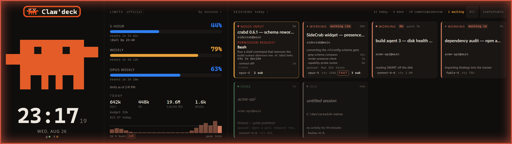

# SideCrab 🦀

[](https://github.com/Dixie-sketch/Clawdeck/actions/workflows/ci.yml)
[](LICENSE)
[](#what-you-need)
[](#what-you-need)

**An ambient Claude Code status panel for the Corsair Xeneon Edge.**

> **New here?** Read [**Getting started**](docs/GETTING-STARTED.md): a 20-minute walkthrough from
> nothing installed to a working panel, with what you should see at each step.

> **Changed in 0.29.0 (2026-09-21): SideCrab moved from the iCUE widget to a standalone panel.**
> iCUE 5.51.40 blocks the widget's requests to the companion and there is no fix on the widget's
> side, so the panel now runs in a small window of our own on the Xeneon Edge, with no iCUE in the
> loop. The widget still ships for iCUE builds before 5.51.40. Read
> [**Install notes: moving to the standalone panel**](docs/UPGRADING-TO-STANDALONE.md) for a fresh
> install or an upgrade from the widget.

SideCrab turns the Xeneon Edge on your desk into a live view of every Claude Code session on
your PC. Session cards, rate-limit gauges with a reset countdown, today's token burn, a clock, a
"needs your attention" alert, and a pixel crab whose mood *is* the status. When a session stops to
ask you something, you find out from across the room instead of by cycling through terminal
windows. Then you can answer it from the panel.



---

## What you need

| | Required | Notes |
|---|---|---|
| **Operating system** | **Windows 10 or 11** | Windows only. The companion is a Windows service and the notifier uses Windows toasts. There is no macOS or Linux build. |
| **Corsair iCUE** | **5.44 to 5.51.39** for the widget | The original host is an iCUE *widget*. Double-clicking the package to import it needs iCUE 5.46.67 or newer; on older iCUE you import from inside the app. **On iCUE 5.51.40 or newer the widget cannot reach the companion** (see "iCUE 5.51.40 and newer" under Known caveats): run the standalone panel host instead, which needs no iCUE at all. |
| **A display iCUE calls `dashboard_lcd`** | The **Xeneon Edge** (2560 × 720) | The panel is designed full-screen for the Edge. Smaller iCUE slots get a reduced layout. |
| **Claude Code** | Installed and used on the **same PC** | The companion reads Claude Code's local session data. It cannot see sessions on other machines. |
| **PowerShell 7** (`pwsh`) | For the companion installer | Not Windows PowerShell 5.1. |
| **Python 3.13** | For the companion | A real install on `PATH`. The Microsoft Store "python" alias stub is rejected, because it cannot host a background service. |
| **.NET 10 SDK** and the **WebView2 Runtime** | Standalone panel host only | The SDK builds the host once (`Install-SideCrab.ps1 -Panel` runs the build); the Desktop Runtime it installs runs it. WebView2 ships with Windows 11 and most Windows 10 installs. |

Everything runs on one PC and talks only over `127.0.0.1`. Nothing is sent anywhere.

---

## Three ways to run it

**Standalone panel host + companion (recommended, no iCUE in the loop).** Run the small local
service, `crabd`, on the PC where you use Claude Code. It serves the panel page itself at
`http://127.0.0.1:2722/panel/`, and a small window (`SideCrab.Panel`, .NET 10 + WebView2) shows it
full-screen on the Xeneon Edge: borderless, always on top, never steals focus, no taskbar entry,
pinned to the Edge by its device id and re-pinned after sleep and display changes. Live session
cards, limit gauges with a depletion forecast, burn history and an optional daily token budget, a
daily recap with a drillable week strip, and alerts when a session is waiting on you. The one
thing missing is the CPU and GPU temperatures, which came from iCUE's sensor plugin and have no
source here yet. This works on any iCUE version, and with no iCUE at all.

**iCUE widget + companion (iCUE 5.44 to 5.51.39).** The original host: the same panel imported
into iCUE as a widget on the Edge, with the temperature row. It cannot reach the companion on iCUE
5.51.40 or newer.

**Widget only.** Install the widget and run nothing else. You get the crab, the clock, and the
CPU and GPU temperatures your iCUE sensors expose. No setup, no background process. Claude Code
data is simply absent, and the panel says so.

---

## How it works

```
Claude Code hooks ──POST──▶  crabd (127.0.0.1:2722)  ◀──poll── SideCrab widget (iCUE / Xeneon Edge)
~/.claude usage + JSONL ──▶  one /v1/state JSON feed  ──write─▶ /v1/action · /v1/config
                             + blocking hook answers  ◀──poll── notifier (Windows toasts)
                             + GET /panel/ (the same widget) ◀── SideCrab.Panel (standalone host, WebView2)
```

1. **Claude Code tells crabd what is happening.** The installer adds a few *hooks* to your
   `~/.claude/settings.json`. Each one is a tiny localhost POST that fires when a session starts,
   when you submit a prompt, when a session stops, and when it needs your attention. They time out
   in two seconds and never block Claude Code if crabd is not running.
2. **crabd keeps the picture.** It turns those events into per-session state (working, waiting,
   finished, needs input), reads your rate limits from the same local credentials Claude Code
   uses, and reads the session transcripts read-only for token burn and elapsed time. It serves all
   of that as one JSON document on `http://127.0.0.1:2722/v1/state`.
3. **The widget draws it.** Every three seconds the iCUE widget polls that URL and repaints. The
   crab's posture is the summary: calm when all is well, alert when something waits on you, worried
   when the feed is stale or gone. The standalone host loads the very same page from crabd at
   `/panel/`, so there is one panel, not two.
4. **Taps go back the same way.** Acknowledge, dismiss, pin, "Continue", and (if you turn it on)
   approve or deny go to crabd on localhost. Nothing free-text is ever sent to a session.

**What the companion reads:** `~/.claude` (session transcripts, hook payloads, the local usage
credential). **What it never does:** write to `~/.claude`, log or transmit your OAuth token, listen
on a network interface, or send anything off the machine. The only outbound call is the usage-limit
check to Anthropic's API with your own token, the same call Claude Code makes.

**The panel is honest about not knowing.** No companion, a stopped companion, or a feed older than
30 seconds all produce a worried crab and a "data as of HH:MM" banner. Unknown values render as an
em-dash, never as zero. A green-looking panel always means the data is fresh.

---

## Install

The order changed in 0.29.0: the companion comes first, the standalone panel host is the
recommended second step, and the iCUE widget is the alternative for iCUE builds before 5.51.40.
[Install notes](docs/UPGRADING-TO-STANDALONE.md) has the same steps with what you should see, and
the upgrade path from the widget.

### Step 1 — the companion (10 minutes)

Open PowerShell 7 on the PC where you run Claude Code (add `-Panel` to the install line to do
Step 2 in the same run):

```powershell
git clone https://github.com/Dixie-sketch/Clawdeck.git C:\Dev\sidecrab
cd C:\Dev\sidecrab
pwsh -File .\setup\Install-SideCrab.ps1 -WithToast
```

The installer:

- registers a logon Scheduled Task for `crabd` (and the notifier if you asked for it), and starts it,
- backs up `~/.claude/settings.json`, then merges in the SideCrab hook entries. Re-running never
  duplicates them and other hooks are left alone,
- registers the toast identity and the `sidecrab-ack:` handler for the notifier, under `HKCU`,
  no elevation needed,
- asks whether to enable panel approvals. Say no until you have read the section below.

Then check it:

```powershell
pwsh -File .\setup\Install-SideCrab.ps1 -Status   # read-only status of every piece
pwsh -File .\setup\Test-SideCrab.ps1              # end-to-end smoke test, PASS/FAIL table
```

Start a Claude Code session. Within a few seconds a card for it appears on the panel.

### Step 2 — the standalone panel host (5 minutes, recommended)

Works on any iCUE version and on a PC with no iCUE at all. It needs the companion from Step 1 and
the .NET 10 SDK once.

```powershell
pwsh -File .\setup\Install-SideCrab.ps1 -Panel      # builds panel-host\dist\SideCrab.Panel.exe, registers SideCrab-panel, starts it
```

Within a few seconds the panel appears full-screen on the Xeneon Edge. If iCUE is still drawing
its own dashboard on that screen, turn that dashboard off in iCUE for the Edge (the Edge tile's
screen or dashboard settings); iCUE keeps running your fans and lighting. Settings live in
`~/.sidecrab/panel-settings.json` (optional; every key has a default):

```jsonc
{
  "crabdPort": 2722,
  "display": { "deviceId": "CRXED00", "width": 2560, "height": 720 },   // the Edge's PnP id, or its exact size
  "props":   { "clock24": true, "accentColor": "#BE7E6E", "alertFlash": true, "crabStyle": true }
}
```

`props` take the same names as the widget's iCUE settings (`clock24`, `alertFlash`, `crabStyle`,
`textColor`, `accentColor`, `backgroundColor`, `transparency`, `touchDiag`). Quiet hours, toast,
digest and budget are not props here: `config.json` is their one home in this host. The pairing
code for approvals is read from `~/.sidecrab/panel-token` by the host itself. The host logs what
it did to `~/.sidecrab/logs/panel.log`: which display it picked, the viewport it measured, every
re-pin.

### Step 3 — the iCUE widget instead (iCUE 5.44 to 5.51.39 only)

1. Download `SideCrab-<version>.icuewidget` from the
   [releases page](https://github.com/Dixie-sketch/Clawdeck/releases).
2. Import it into iCUE: double-click the file (iCUE 5.46.67+), or in iCUE open the Xeneon Edge's
   dashboard editor and import the widget from the file.
3. Place it **full-screen** on the Xeneon Edge, and pick a CPU and a GPU sensor in its settings.

The widget stops reaching the companion the day iCUE updates itself past 5.51.39; switch to Step 2
when that happens.

### Keeping the limit gauges alive (recommended)

The gauges read the same OAuth token Claude Code uses. That token lives about six hours and is
only rewritten when a terminal `claude` session makes an API call, so on a machine where you
mostly use the desktop app the gauges go dark by the next morning. Fix it once with a long-lived
token:

```powershell
claude setup-token                                            # opens a browser sign-in, prints a token
pwsh -File .\setup\Install-SideCrab.ps1 -LimitsToken           # paste it; stored DPAPI-encrypted for your account
```

crabd uses the stored token only when the CLI's own token has expired. It is decrypted in memory
on each poll, never logged and never served. `Install-SideCrab.ps1 -Status` shows whether one is
stored; `Test-SideCrab.ps1` shows which token is answering.

### Updating, uninstalling

```powershell
git -C C:\Dev\sidecrab pull
pwsh -File C:\Dev\sidecrab\setup\Update-SideCrab.ps1      # restarts the tasks on the new code
pwsh -File C:\Dev\sidecrab\setup\Uninstall-SideCrab.ps1   # removes tasks, hooks and both registry keys
```

The iCUE widget updates separately: import the new `.icuewidget` from the releases page. The two
sides are built to tolerate a version gap, so updating one before the other is fine. The
standalone panel host needs no import: `Update-SideCrab.ps1` rebuilds it from the pulled source
and restarts it, and the window reloads the page crabd serves.

---

## Using it

### At a glance

- **The crab** is the summary. Calm = nothing needs you. Alert with a glow = a session is
  waiting. Worried and grey = the data is stale or the companion is gone. It sweats when a limit
  is nearly full, and it has a few tricks it does on its own.
- **Session cards** show state, model, elapsed time, the repo it is working in, a hairline for how
  full that session's context window is, and a "queued: …" line when you have sent it a next step.
- **Limit gauges** show each rate-limit window, how full it is, when it resets, and a forecast of
  when the recent burn rate would fill it.
- **TODAY** shows token burn with a sparkline, the daily budget if you set one, and cost when
  Claude Code's telemetry is flowing to the companion.
- **The week strip** is the daily recap: sessions, commits in your configured repos, tokens.
- **The hardware row** shows CPU and GPU temperatures with the name of the sensor each reading
  comes from, plus this PC's CPU and memory use while the companion runs.

### Touch

| Gesture | Does |
|---|---|
| **Tap** a card | Opens its detail sheet: the question it is asking, subagents, the last event |
| **Swipe** a card | Acknowledge or dismiss it |
| **Long-press** a card | Pin it to the front (again to unpin) |
| **Two-finger tap** anywhere | Acknowledge every waiting session at once |
| **Tap the crab** | Same as two-finger tap |
| **Pull down** from the top edge | Refresh now |
| **Tap a gauge** | That window's detail: how full, when it resets, when it would fill |
| **Tap a day** in the week strip | Drill into that day; page with prev/next |
| **Tap the moon** beside the clock | Quiet for an hour · stay awake through tonight's window · back to schedule |
| **Filter and density chips** (top right) | Show only waiting / working / finished; comfortable or compact cards |

### Sending a session its next step

On a stopped or finished session, tap the card and pick a **continue prompt**: "Continue", "Run the
tests", "Commit + push", or any you add in the config file. It is delivered the next time that
session's Stop hook fires. The vocabulary is fixed on purpose. There is no free-text input on the
panel and no supported way to inject arbitrary text into a live session.

### Approving a permission request from the panel

When a session is waiting on a tool permission, the card shows the request with a countdown, and
you can approve or deny it from the panel. **This ships off.** Read the next section before you
turn it on. Turning it on is three steps:

```powershell
pwsh -File .\setup\Install-SideCrab.ps1 -WithApprovals   # 1. arm it (prints the pairing code)
pwsh -File .\setup\Install-SideCrab.ps1 -PairingCode     #    ...or print the code again later
```

2. In iCUE, open the SideCrab widget's settings and paste the code into **Approval Pairing
   Code**. With the standalone panel host there is nothing to paste: it reads the code from
   `~/.sidecrab/panel-token` itself. 3. Tap Approve or Deny on the next request. A tap without the code, or with a wrong
   one, is refused and the terminal dialog keeps the decision, exactly as if the panel were not
   there.

---

## Configuration

`~/.sidecrab/config.json`, all keys optional. Most of these are also editable from the panel's
settings sheet.

```jsonc
{
  "quietHours": { "start": "22:00", "end": "07:00" },  // dim panel, no glow, no toasts
  "toast":  { "enabled": true, "thresholdSec": 120, "approvalThresholdSec": 20 },
  "digest": { "enabled": false, "time": "09:00" },     // one "yesterday" toast per day
  "budget": { "dailyOutputTokens": 5000000 },          // null to clear; one toast on crossing
  "continuePrompts": ["Continue", "Run the tests"],    // extra taps on a stopped session
  "panelApprovals": { "enabled": false },              // approve/deny from the panel — see below
  "recapRepos": ["C:\\Dev\\sidecrab"]                  // extra repos to count commits in
}
```

`continuePrompts` and `recapRepos` are hand-edited only. The panel reads them but does not write
them.

---

## Before you turn on panel approvals

Approving a tool call from a wall-mounted touchscreen is a real security decision, so the
guarantees are worth reading rather than assuming:

- **It ships off.** The installer asks.
- **crabd never decides on its own.** There is no code path that answers "allow" without a
  `decide` request arriving on localhost first. The normal source of that request is a tap on
  the panel.
- **Only a paired panel can decide (crabd 0.29.0 / widget 0.27.0).** crabd mints a
  ten-character **pairing code** into `~/.sidecrab/panel-token` on first start, and every
  Approve or Deny must carry it. The code lives in the widget's iCUE settings, or in the
  standalone host's injected page object, which no web page can read, so a page you visit that
  forges the widget's `null` Origin, or a DNS-rebinding page, gets a `403` (or a `421`) and
  nothing else. Ten wrong codes in a minute lock the gate for a minute. Each tap also names
  the exact request it saw (`requestId`), so a tap can never land on a request that replaced
  it. This closed the SEC-a and WID-a findings recorded in [`SECURITY.md`](SECURITY.md).
- **Every failure is a pass-through.** Timeout, no tap, disabled, malformed, companion down: all
  return no decision, and the normal terminal dialog does its job. The worst case is the behaviour
  of a machine where SideCrab was never installed.
- **The toast has no buttons.** When a request goes undecided, the notifier tells you and says
  "Decide on the panel." A notification action is one click from a lock screen; that is fine for
  acknowledging a dot and not for allowing a command.
- **Verified live, operator present (2026-08-27)** via `setup\Verify-PanelApproval.ps1`: a panel
  Approve ran the command with no keyboard, a panel Deny blocked it, and a full minute of ignoring
  both surfaces ended in the pass-through with the terminal dialog in charge. Two behaviours worth
  knowing: the terminal dialog is **raced, not suppressed** (whichever surface answers first wins),
  and the two-button card carries a real mis-tap risk. Run the same script on your own machine
  before trusting it.

---

## Troubleshooting

| You see | It means | Do |
|---|---|---|
| Worried grey crab, "data as of HH:MM" | The companion is stopped, or the feed is older than 30 s | `Install-SideCrab.ps1 -Status`, then `Update-SideCrab.ps1` to restart the task |
| Panel is fine but no session cards | Hooks are not firing | Check `~/.claude/settings.json` has the SideCrab entries; re-run the installer, which merges them idempotently |
| Limit gauges show an em-dash and "token expired" | The CLI's access token in `~/.claude` has passed its ~6 h life and nothing has refreshed it | Store a long-lived token once (below), or run any `claude` command in a terminal to refresh the file |
| Temperatures frozen or wrong | The wrong iCUE sensor is selected | The row names the sensor it reads. Pick the right one in the widget settings |
| Widget dark since an iCUE update, companion healthy | iCUE 5.51.40 or newer refuses the widget's requests to `127.0.0.1` | Run the standalone panel host: `Install-SideCrab.ps1 -Panel` (Step 3) |
| The Edge shows "SideCrab companion not reachable" | The panel host is up, crabd is not, or is older than 0.31.0 | `Update-SideCrab.ps1`; the host retries every 5 s by itself |
| The panel host window is on the wrong screen, or nowhere | The Edge was not found by device id or by its 2560x720 size | Read `~/.sidecrab/logs/panel.log` (it lists every display); set `display.deviceId` in `panel-settings.json` |
| The panel host looks scaled or cropped | The Edge is not at 100% scale | The host corrects its zoom from the measured viewport; `Test-SideCrab.ps1` has a `panel viewport` row |
| "No usable python.exe found" | Only the Store alias stub is on `PATH` | Install Python 3.13 from python.org and tick "Add to PATH" |
| A finished session still reads "working" | A session was killed by an app restart, so no end hook fired | It clears itself within 15 minutes; taps on it are refused rather than queued |
| Something else | | `pwsh -File .\setup\Test-SideCrab.ps1` prints a PASS/FAIL table for every piece |

---

## Known caveats

- **iCUE 5.51.40 and newer block the widget.** That build added a widget URL-permission layer:
  every request the widget makes to `127.0.0.1` is refused inside iCUE, and a manifest
  permissions entry works after an import and dies on the next iCUE start, because iCUE saves the
  grant without the port a loopback grant needs. Nothing in the widget can change that. The
  standalone panel host exists for exactly this; the widget stays in the release for older iCUE
  builds.
- **The glow is parked.** The Corsair SDK crashes in every non-interactive console context tested,
  so the `SideCrab-glow` task ships disabled on purpose, and the panel's fleet dot honestly shows
  it stopped. The installer will not re-enable it on a re-run.
- **The status-line feed is a fallback, not a replacement.** It fires only in an interactive
  terminal session. The credential-based limits path works regardless.
- **Cost figures need telemetry.** `costUSD` appears only when Claude Code's OTLP telemetry is
  flowing to the companion. It is never estimated from token counts.

## Known issues

The honest list lives in [`docs/BACKLOG.md`](docs/BACKLOG.md). Worth knowing before you install:

- **Panel approvals need pairing** - a widget older than 0.27.0 or a companion older than
  0.29.0 cannot approve anything: the tap is refused and the terminal dialog decides. Update
  both, then enter the pairing code (see above). Approvals still ship off.
- **GHOST-a** - after a crabd restart, a session that was killed by an app restart can read
  `working` for up to 15 minutes before transcript aging retires it.
- About two dozen small cosmetic or edge-case items under "Small, known, not yet fixed".

## Security and privacy

Localhost-only by design. The companion reads `~/.claude` read-only, never writes there, and
transmits nothing. There is no telemetry, no crash reporting, no update check.
[`SECURITY.md`](SECURITY.md) has the threat model, the disclosed residuals, and how to report a
vulnerability.

---

## For developers

Want to contribute? Read [`CONTRIBUTING.md`](CONTRIBUTING.md) first: it is short, and it explains
the four rules every change is held to.

| Path | What |
|---|---|
| `widget/` | The panel: HTML/CSS/JS, one tree for both hosts. Packaged to `.icuewidget` with Corsair's WidgetBuilder CLI (`icuewidget validate widget` · `icuewidget package widget`) for iCUE, and served as-is by crabd at `/panel/` for the standalone host. Dev notes in `widget/DEV.md` |
| `panel-host/` | **SideCrab.Panel**: the standalone host, a .NET 10 WinForms + WebView2 kiosk window pinned to the Xeneon Edge. `setup\Build-SideCrabPanel.ps1` publishes it; `SideCrab.Panel.Tests` covers its navigation lock, display selection and script injection |
| `companion/` | **crabd**: hook receiver, session state machine, limits + burn reader, history, `/v1/state` |
| `notifier/` | Native Windows toasts: waiting session, permission request, daily digest, budget crossed, companion gone quiet |
| `lighting/` | **sidecrab-glow**: pulses Corsair RGB while a session waits (parked, see above) |
| `hooks/` | The Claude Code hook fragment and the status-line command that feed crabd |
| `setup/` | Install / update / uninstall / smoke-test / verification scripts |
| `docs/` | [Getting started](docs/GETTING-STARTED.md) · [PRD](docs/PRD.md) · [STATE-CONTRACT](docs/STATE-CONTRACT.md), the producer/consumer API and the source of truth for both sides · [BACKLOG](docs/BACKLOG.md) · audit findings |

Design rules that drive most decisions: **honest failure** (unknown is `null` or an em-dash,
never `0`, never a stale value re-served), **every alert must survive a healthy night** (each
threshold is replayed against real data, each gate mutation-proven), **contract first** (`schema`
marks the last breaking shape; additive fields are detected by presence), and **a fixed
vocabulary, never free text**.

Tests, all headless:

```powershell
python -m unittest discover -s companion\tests -t companion\tests
python -m unittest discover -s notifier\tests  -t notifier\tests
python -m unittest discover lighting\tests
pwsh -File .\setup\tests\RunTests.ps1
node widget\tests\test_ordering.js
dotnet test panel-host\SideCrab.Panel.Tests
```

---

## License

MIT. See [`LICENSE`](LICENSE). SideCrab is an independent hobby project and is not affiliated with
or endorsed by Anthropic or Corsair; *Claude* and *Claude Code* are Anthropic's marks and *iCUE* and
*Xeneon* are Corsair's, named here only to say what the panel works with.
